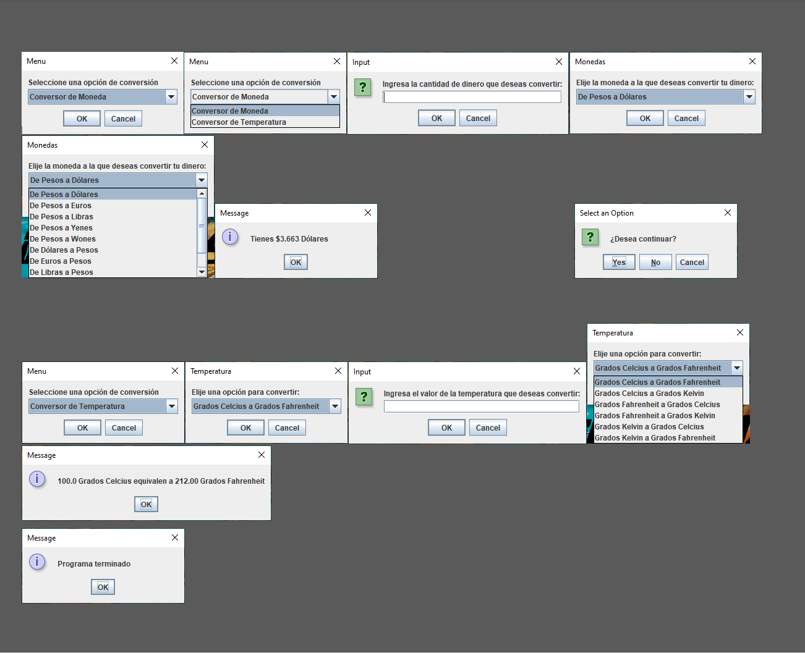

# Challenge Conversor-AluraLatam
## Detalles del proyecto

Este proyecto corresponde al Challenge Backend Java de Oracle Next Education. La premisa del challenge consistía en crear un conversor de divisas(monedas) y de ser posible agregarle algún otro conversor.

Este programa se desarrollo utilizando los componentes de Java Swing en específico en este programa se emplearon las extensiones de JOptionPane para la interfaz gráfica y se basa con un diseño simple para prever la buena experiencia del usuario, además, se intentó en su mayoria minimizar cualquier tipo de error que implique una mala experiencia en la ejecución.

En este programa todos los valores de conversión son estáticos para las divisas, no se implementó ninguna API, por lo tanto las conversiones monetarias son resultados aproximados.

## Cómo funciona
El programa convierte varios valores otorgados por el usuario con base a la operación solicitada, estas son presentadas en dos grupos:

- Conversor de Monedas: Pesos Argentinos, Dólares, Euros, Libras, Yenes, Wones.
- Conversor de Temperatura: Celsius, Kelvin, Fahtenheit.

# Cómo ejecutar el programa
Primero debes de descargar el zip del proyecto y luego abrelo en tu Java IDE, sigue la ruta Challenge-Conversor/src/interfazGrafica/InterfazGrafica.java.
Ejecuta la clase main y el programa compilará e iniciará.
